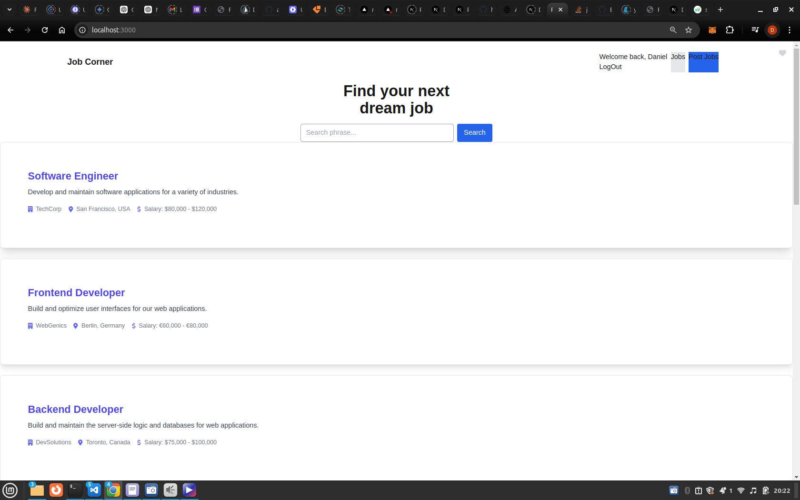
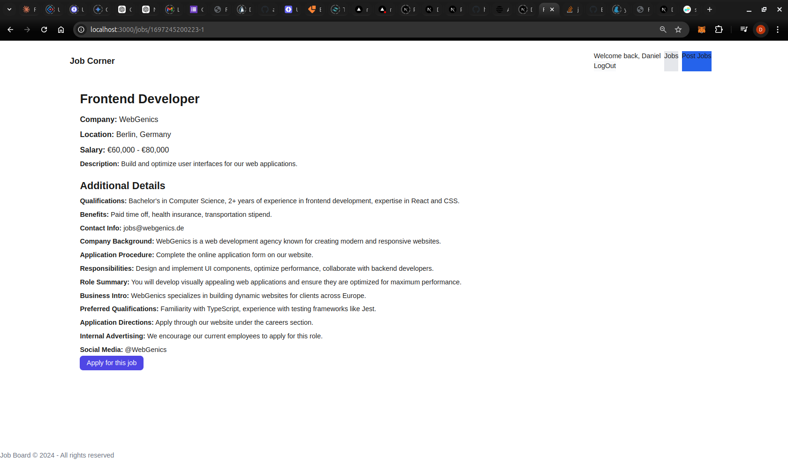
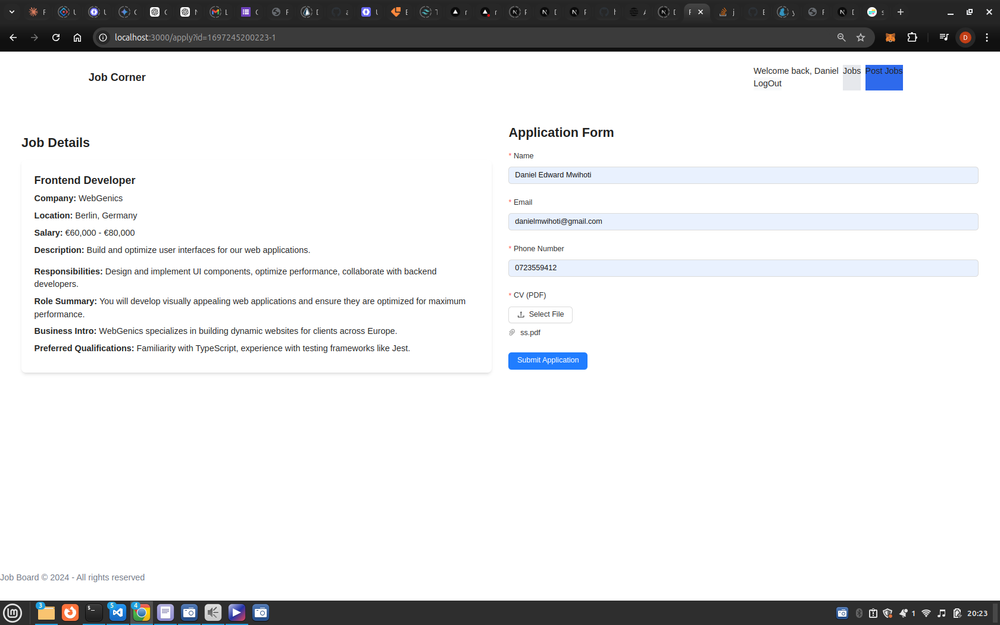
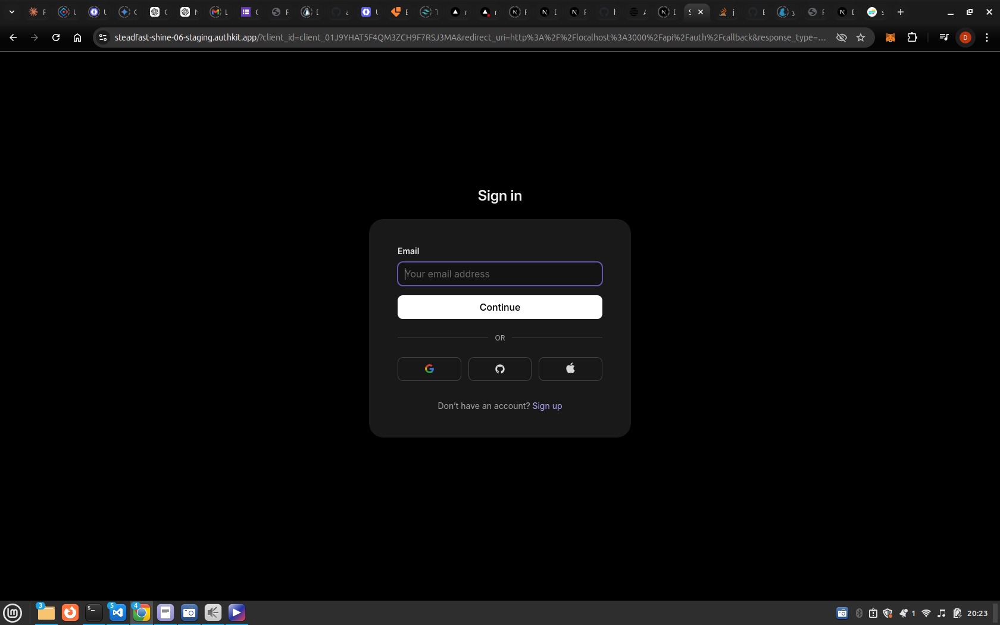
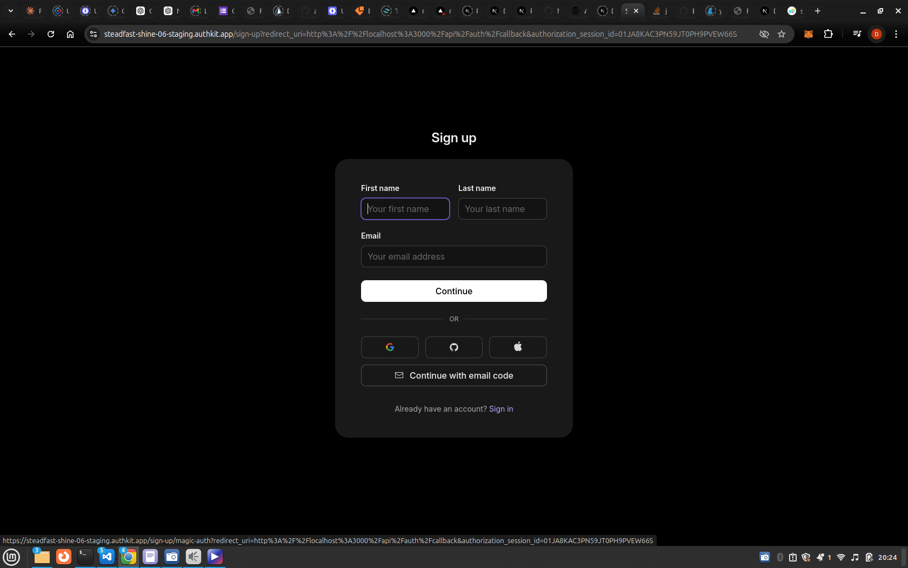
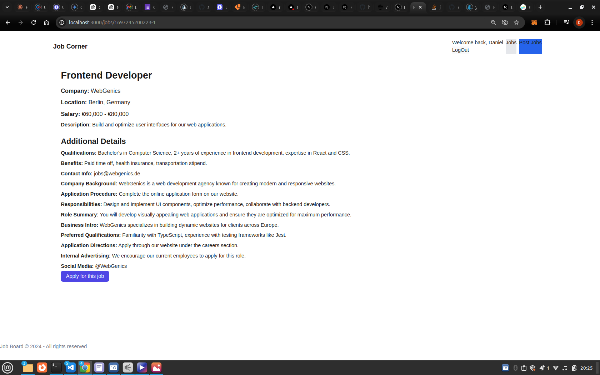

# Job corner web-application

This project aims to provide a platform for listing remote job opportunities and enabling job seekers to apply seamlessly. Below are the key features and functionalities of the project:


## Job corner -features
* Authentication and User Management
```
WorkOS Integration: Utilizes WorkOS for secure user authentication and session management.
```

* Job Listings
``` 
Provides job seekers with a  list of remote job opportunities.
```
* Job Details: Detailed job descriptions with responsibilities, qualifications, benefits, and application procedures.
* Application Process: Enables users to apply for jobs directly through the platform, w
* Frontend and UI
Responsive Design: Ensures a seamless experience across devices with responsive design principles.
* Tailwind CSS: Utilizes Tailwind CSS for styling to maintain a consistent and modern user interface.
* Dynamic Routing: Uses Next.js for dynamic routing and server-side rendering, optimizing performance and SEO.
Backend and Database
Prisma ORM: Integrates Prisma for database management, ensuring efficient data querying and manipulation.
* API Integration: Implements RESTful APIs for job management and user interactions, enhancing scalability and flexibility.
Additional Features
* Error Handling: Implements robust error handling and validation to improve user experience and reliability.
<div >






</div>
## Getting Started
To get started with the project locally, follow these steps:

* Clone the repository from GitHub.
* Install dependencies using yarn install.
* Set up environment variables for configuration (e.g., WORKOS_CLIENT_ID, WORKOS_CLIENT_SECRET).

* Run migrations: npx prisma migrate dev --name init

* Run the development server with yarn dev.
* Open the project in your browser at http://localhost:3000.

First, run the development server:

```

yarn dev
# or
pnpm dev
# or
bun dev
```

Open [http://localhost:3000](http://localhost:3000) with your browser to see the result.

You can start editing the page by modifying `app/page.js`. The page auto-updates as you edit the file.

This project uses [`next/font`](https://nextjs.org/docs/basic-features/font-optimization) to automatically optimize and load Inter, a custom Google Font.

## Learn More

To learn more about Next.js, take a look at the following resources:

- [Next.js Documentation](https://nextjs.org/docs) - learn about Next.js features and API.
- [Learn Next.js](https://nextjs.org/learn) - an interactive Next.js tutorial.

You can check out [the Next.js GitHub repository](https://github.com/vercel/next.js/) - your feedback and contributions are welcome!

## Deploy on Vercel
Production Build Errors: Currently encountering errors during the production build process.
Link coming soon []
[
Am fixing this error that I am getting after running yarn build
 Export encountered errors on following paths:
        /_not-found/page: /_not-found
        /apply/page: /apply
error Command failed with exit code 1.
info Visit https://yarnpkg.com/en/docs/cli/run for documentation about this command.

]

[
        remote-jobs-tnp3-3x8mbkyuf-mwihotis-projects.vercel.app
]
